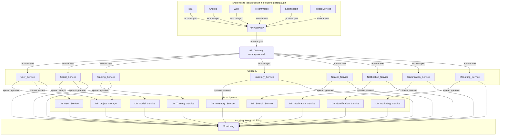

```mermaid
flowchart TD
subgraph Клиентские Приложения и внешние интеграции
    iOS -->|использует| A(API Gateway)
    Android -->|использует| A(API Gateway)
    Web -->|использует| A(API Gateway)
    e-commerce -->|использует| A(API Gateway)
    SocialMedia -->|использует| A(API Gateway)
    FitnessDevices -->|использует| A(API Gateway)
    end


    
 subgraph Сервисы
    User_Service 
    Social_Service 
    Training_Service 
    Inventory_Service
    Search_Service
    Notification_Service
    Gamification_Service
    Marketing_Service
    end
  A --> |использует|B(API Gateway межсервисный)
    B --> |использует| User_Service
    B --> |использует| Social_Service 
    B --> |использует| Training_Service
    B --> |использует| Inventory_Service
    B --> |использует| Search_Service
    B --> |использует| Notification_Service
    B --> |использует| Gamification_Service
    B --> |использует| Marketing_Service      

    subgraph Базы Данных
    DB_User_Service 
    DB_Object_Storage
    DB_Social_Service 
    DB_Training_Service 
    DB_Inventory_Service
    DB_Search_Service
    DB_Notification_Service
    DB_Gamification_Service
    DB_Marketing_Service
    end

    User_Service --> |хранит данные| DB_User_Service
    User_Service --> |хранит медиа| DB_Object_Storage
    Social_Service --> |хранит медиа| DB_Object_Storage
    Social_Service --> |хранит данные| DB_Social_Service 
    Training_Service --> |хранит данные| DB_Training_Service
    Inventory_Service --> |хранит данные| DB_Inventory_Service
    Search_Service --> |хранит данные| DB_Search_Service
    Notification_Service --> |хранит данные| DB_Notification_Service
    Gamification_Service --> |хранит данные| DB_Gamification_Service
    Marketing_Service --> |хранит данные| DB_Marketing_Service 

    subgraph Система мониторинга [Logging, Metrics,Tracing]
    Monitoring
   
    end 
  
DB_User_Service --> Monitoring
DB_Object_Storage --> Monitoring
DB_Social_Service --> Monitoring
DB_Training_Service --> Monitoring
DB_Inventory_Service --> Monitoring
DB_Search_Service--> Monitoring
DB_Notification_Service--> Monitoring
DB_Gamification_Service--> Monitoring
DB_Marketing_Service--> Monitoring

  User_Service --> Monitoring
    Social_Service --> Monitoring
    Training_Service --> Monitoring
    Inventory_Service--> Monitoring
    Search_Service--> Monitoring
    Notification_Service--> Monitoring
    Gamification_Service--> Monitoring
    Marketing_Service--> Monitoring
```
