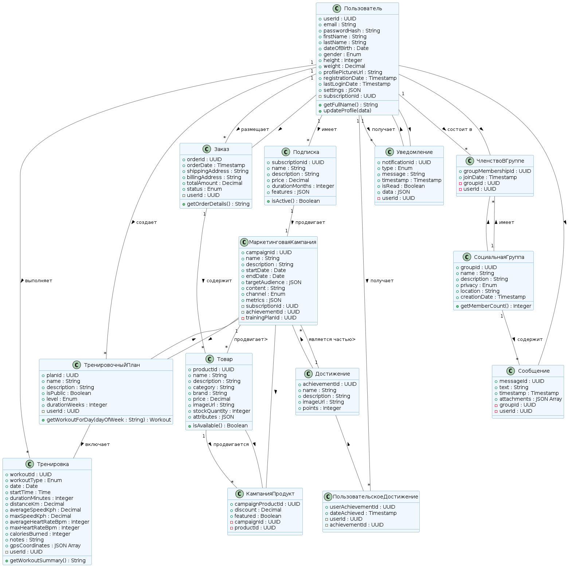
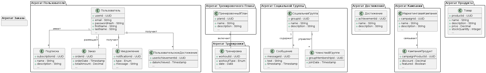

[Heading](../heading.md)

[Previous chapter](13-basic-architecture.md)

[Next chapter](15-risk-analysis.md)

# Основные представления

## Функциональное представление

Функциональное представление соответствует доменной модели.

## Информационное представление

В информационном представлении спортивного приложения с социальной сетью, можно выделить следующие ключевые агрегаты:
1.  Пользовательский Агрегат 
1. Агрегат Тренировки
1. Агрегат Тренировочного Плана
1. Агрегат Социальной Группы
1. Агрегат Достижения
1. Агрегат Кампании
1. Агрегат Продукта
1. Агрегат Заказа

## Многозадачность

Реализация многозадачности в облачном сервисе спортивного приложения с социальной сетью требует комплексного подхода, учитывающего особенности распределенной архитектуры, масштабируемости и надежности.
Основные стратегии и технологии, которые можно использовать:
1. Асинхронные задачи и очереди сообщений. Передача ресурсоемких или долго выполняющихся задач в фоновый режим, чтобы не блокировать основные потоки обработки запросов.
1. Контейнеризация и оркестрация. Использование контейнеров (Docker) для упаковки микросервисов и их зависимостей, а также оркестрация этих контейнеров для автоматического масштабирования, развертывания и управления жизненным циклом.
1. Базы данных с поддержкой многопоточности и масштабируемости. Для масштабирования базы данных можно использовать механизм шардирования.

## Инфраструктурное представление

Список инфраструктурных решений:
1. Предпочтительно использовать облачную платформу, такую как Amazon Web Services (AWS), Google Cloud Platform (GCP) или Microsoft Azure, из-за их масштабируемости, надежности и широкого спектра сервисов
1. Использовать контейнеры (Docker) для упаковки и развертывания микросервисов
1. Использовать управляемые сервисы Kubernetes, для упрощения управления кластером Kubernetes.
1. Для сбора метрик использовать Prometheus
1. Для визуализация метрик и создания дашбордов использовать Grafana.
1. Использовать ELK Stack (Elasticsearch, Logstash, Kibana) для сбора, обработки и анализа логов.
1. Использовать Jaeger или Zipkin для распределенной трассировки запросов и выявления узких мест в производительности.
1. Настроить оповещения(Alerting) на основе метрик и логов для оперативного реагирования на проблемы.
1. Использовать API Gateway (например, Kong, Tyk, AWS API Gateway, Google Cloud Endpoints, Azure API Management) для управления API, аутентификации, авторизации, мониторинга.
1. Разделить приложение на несколько уровней:
   1. Уровень представления (Presentation Layer): UI (клиентские приложения).
   1. Уровень API (API Layer): API Gateway.
   1. Уровень приложений (Application Layer): Микросервисы.
   1. Уровень данных (Data Layer): Базы данных.
   1. Изоляция: Изолировать уровни друг от друга с помощью подсетей и правил безопасности.
 
## Безопасность
Необходимо реализовать меры безопасности например, Web Application Firewall (WAF) для защиты от атак, шифрование данных при передаче и хранении, контроль доступа.

